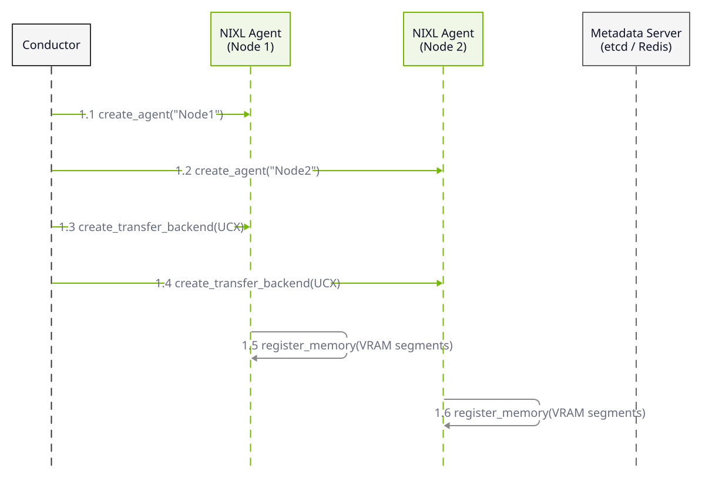
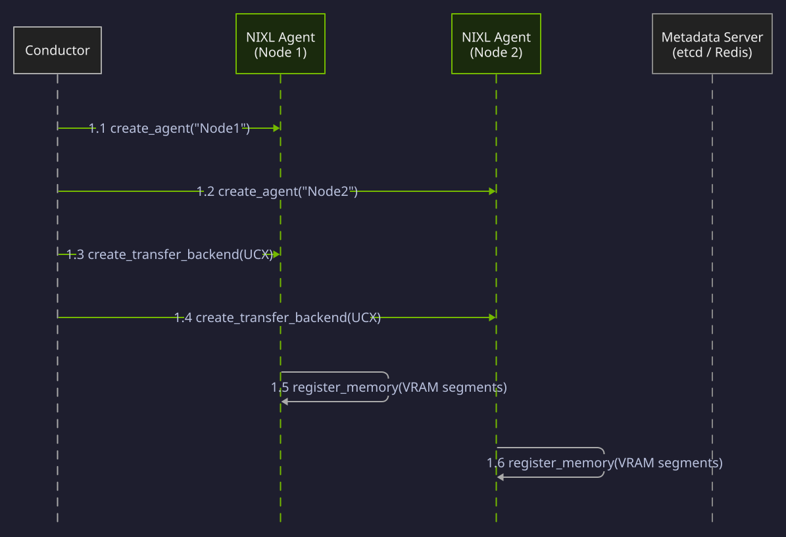
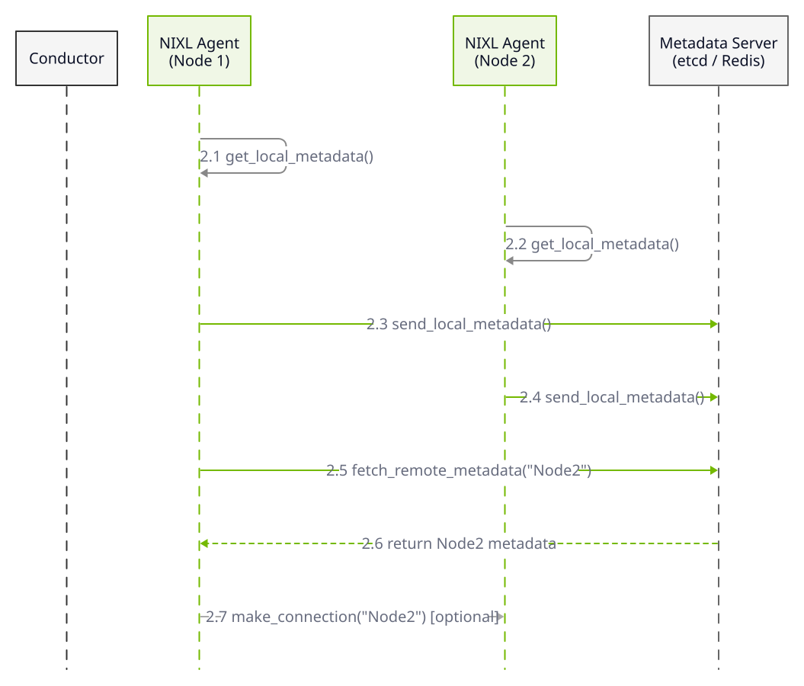
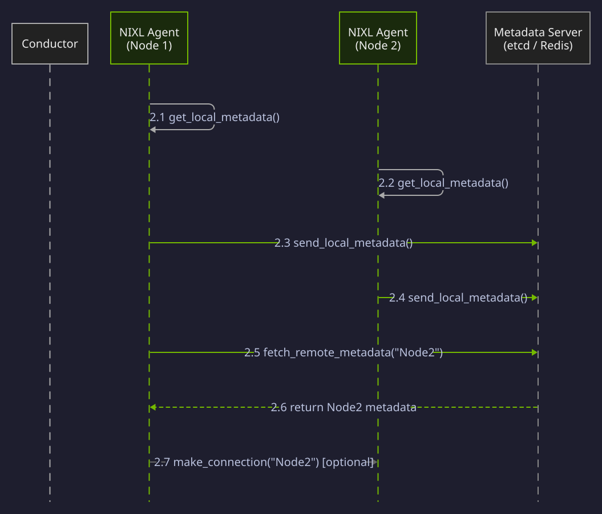
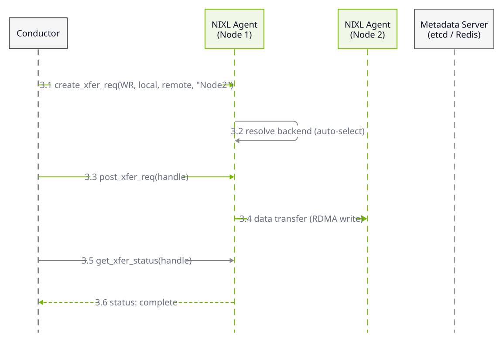
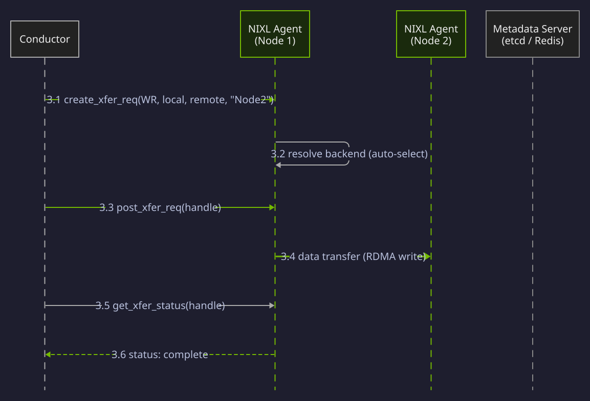
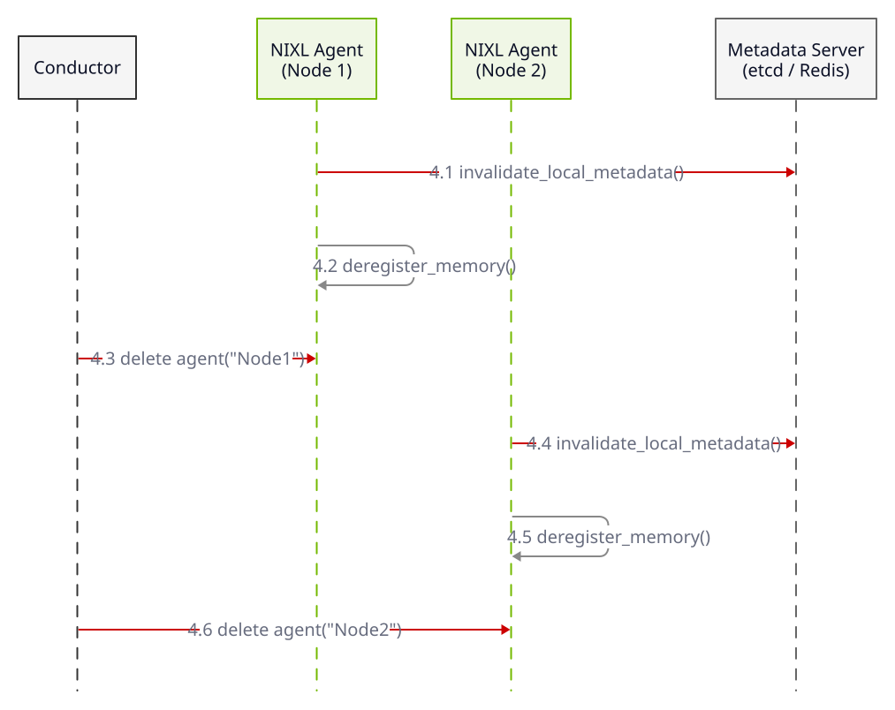
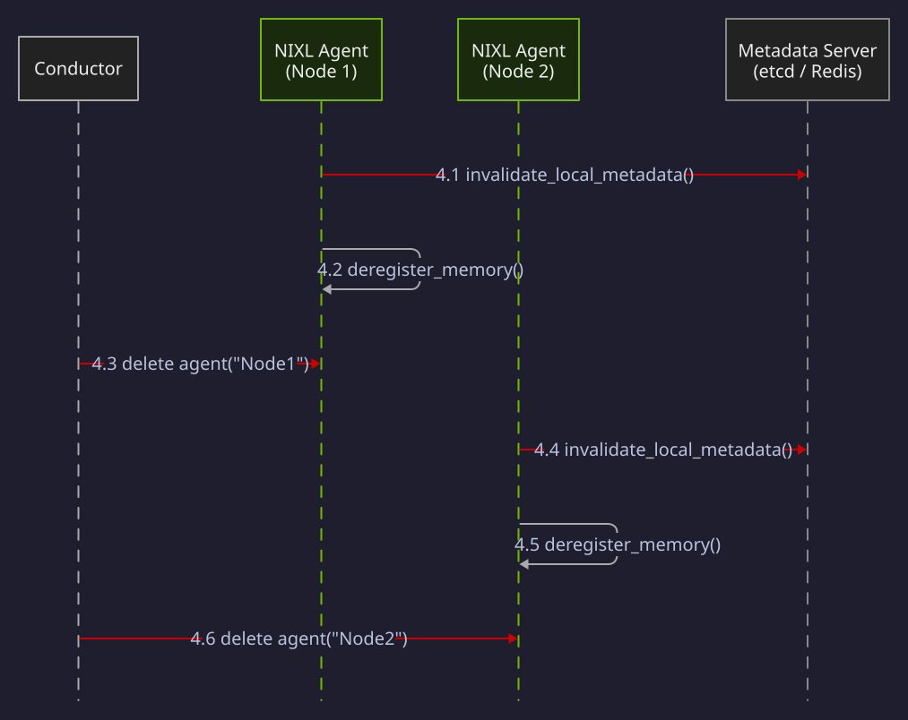
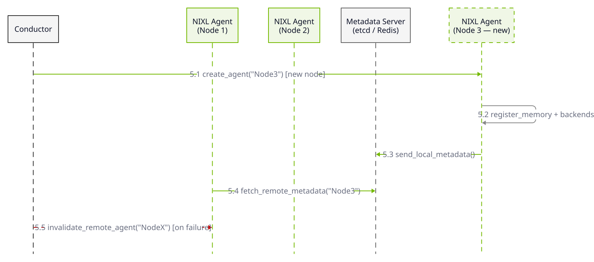
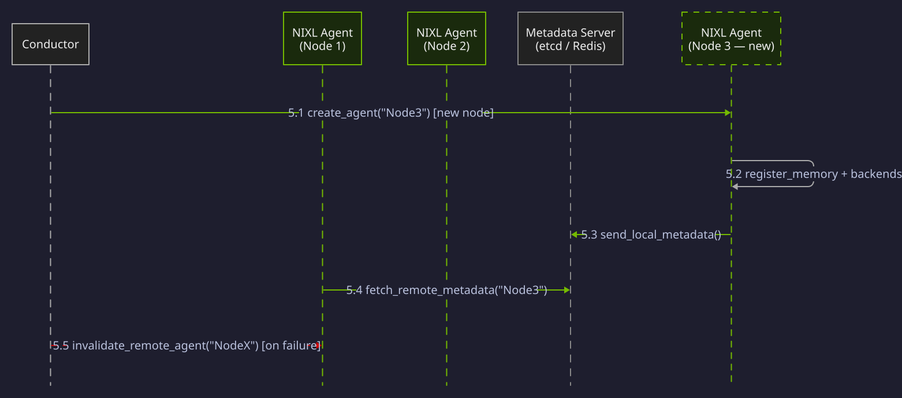

## Design Overview

The Transfer Agent abstracts three entities:

1. **Memory Sections** -- Unify heterogeneous memory and storage types behind a common buffer-list primitive, regardless of whether the underlying resource is VRAM, DRAM, file, object, or block storage.
2. **Transfer Backend Interface** -- Decouples the Transfer Agent from specific transports. NIXL selects the optimal backend based on source and destination memory types and the backends available on both agents.
3. **Metadata Handler** -- Manages the connection and addressing information that Transfer Agents on different workers need to reach each other. Caches remote agent metadata locally to avoid repeated fetches.

The Transfer Agent receives a descriptor list from the inference framework, selects a backend, and returns an asynchronous handle for non-blocking status checks. Supported transports include [RoCE](https://docs.nvidia.com/networking/display/ofedv502180/rdma+over+converged+ethernet+(roce)), [InfiniBand](https://www.nvidia.com/en-us/networking/products/infiniband/), [GPUDirect RDMA](https://developer.nvidia.com/gpudirect), NVMe-oF, TCP, and [NVLink](https://www.nvidia.com/en-us/data-center/nvlink/).

When multiple backends can handle a transfer, NIXL picks the most efficient one automatically. If the source is DRAM and the destination is VRAM, NIXL may choose UCX. If the source is VRAM and the destination is a parallel file system, it may use GPUDirect Storage.

A Transfer Agent is instantiated per inference process and can manage multiple GPU devices. On a DGX server, a single Transfer Agent in the main process accesses all local GPUs and storage nodes. Each Transfer Agent carries a globally unique ID assigned by the inference platform.


## Memory Sections

A Memory Section groups address ranges (segments) of the same type that have been registered with the Transfer Agent. NIXL supports five segment types: VRAM, DRAM, File, Object Storage, and Block Storage.

Each segment represents a contiguous region within its memory type:

- **VRAM (HBM)** -- A contiguous region of GPU high-bandwidth memory, identified by a device pointer and length.
- **DRAM** -- A contiguous region of host memory, identified by a virtual address and length.
- **File** -- A region within a local or remote file, identified by file path and offset.
- **Object Storage** -- An object or set of objects in a distributed store, identified by bucket and key.
- **Block Storage** -- A block-level region, identified by device path and offset range.

When the application registers a Memory Section, NIXL creates the internal structures each backend needs to operate on those segments -- RDMA memory registration keys, GDS file handles, and similar resources. Only the identifiers necessary for remote access are included in the metadata shared with other Transfer Agents; local details stay local.

<Note title="Memory Registration">
When a memory section is registered with the agent, NIXL creates the internal data
structures needed by the transfer backends. Register memory segments during
application initialization so metadata is exchanged only once.
</Note>

## Transfer Backend Interface

Each backend registers with the Transfer Agent during initialization, making the agent aware of available transports.

NIXL automatically selects the optimal backend based on the source and destination memory types. For the full backend support matrix and selection logic, see [Backend Selection](/nixl/user-guide/backend-selection).

NIXL supports the following transfer backends: UCX, GDS, GDS-MT, POSIX, Object (S3, S3_CRT, S3/RDMA), Mooncake, DOCA GPUNetIO, Libfabric, HF3FS, UCCL-P2P, Azure Blob, GUSLI, and INFINIA. Each backend is implemented as a plug-in that registers with the Transfer Agent during initialization. See the [Overview](/nixl/getting-started/overview) page for an interactive diagram showing the full software stack with backend and memory type compatibility.

## Metadata Handler

The Metadata Handler manages the data Transfer Agents need to establish communication -- backend connection information and remote segment identifiers. Metadata exchange happens over a secure side channel or through a centralized store such as etcd or Redis.

NIXL shares only the minimum metadata required for remote access. Local details (RDMA registration keys, internal buffer structures) remain on the originating Transfer Agent.

When a Transfer Agent loads remote metadata, it routes each portion to the appropriate local backend based on the backend type tag in the serialized data. If a tagged backend is not available locally, that metadata portion is ignored.

Metadata exchange belongs on the control path, not the data path. Register memory segments during application initialization so metadata is exchanged once.

The Metadata Handler caches remote agent metadata to support dynamic scaling:

- **Avoid repeated fetches** -- cached metadata eliminates per-transfer lookups.
- **Add agents** -- publish a new agent's metadata to the cache; existing agents discover it without restart.
- **Remove agents** -- invalidate cached metadata to trigger disconnects and purge stale entries.

Adding remote metadata does not open a connection -- it may be a prefetch. An optional connection API exists for eager connection establishment. Removing metadata disconnects any active connection.

<Info>
NIXL operates under the assumption that it is managed by a conductor process responsible for orchestrating the inference process, including memory allocations, handling user requests, and providing the means to exchange metadata.
</Info>

## Data Flow: Two-Node Example

The five phases below -- initialization, metadata exchange, transfer, teardown, and dynamic scaling -- cover the complete Transfer Agent lifecycle. Each phase includes a sequence diagram followed by a detailed walkthrough.

<Info>
In production, metadata exchange typically happens once during initialization,
and only the transfer phase repeats.
</Info>

### Initialization

<div className="diagram-light sequence-diagram">
<Frame caption="Phase 1: Initialization">

</Frame>
</div>
<div className="diagram-dark sequence-diagram">
<Frame caption="Phase 1: Initialization">

</Frame>
</div>

The runtime creates a Transfer Agent per node and optionally passes a device list. It then calls `create_transfer_backend` for each desired transport. Memory segments are registered via `register_memory`, which creates the internal structures each backend needs. The application can target specific backends or let NIXL register with all backends that support the segment's memory type.

```
# list of devices (GPUs, DRAM, NICs, NVMe, etc)
create_agent(name, optional_devices)

# User allocates memory from their preferred devices -> alloced_mem
foreach transfer_backend:
    create_transfer_backend(corresponding_backend_init)
foreach alloced_mem:
    register_memory (desc_list) # or list of desired backend can be specified
```

### Metadata Exchange

<div className="diagram-light sequence-diagram">
<Frame caption="Phase 2: Metadata Exchange">

</Frame>
</div>
<div className="diagram-dark sequence-diagram">
<Frame caption="Phase 2: Metadata Exchange">

</Frame>
</div>

After registration, the runtime exchanges metadata between Transfer Agents. This metadata contains backend connection information and remote segment identifiers -- everything an initiator needs to reach a target.

Optionally, the runtime calls `make_connection` to establish connections eagerly. Without this call, connections are created on the first transfer.

**Side channel approach:** Each agent retrieves its local metadata and sends it directly to the desired remote agents through an out-of-band mechanism.

```
# In each agent:
get_local_metadata()

# Exchange the metadata to the desired agents

# In each agent:
    for each received metadata:
        remote_agent_name = load_remote_metadata()
        make_connection(remote_agent_name) # optional

```

**Central metadata approach:** Each agent sends its metadata to a centralized server (such as etcd or Redis), and other agents fetch from there as needed.

```
# In each agent:
send_local_metadata()

for each target_agent:
    fetch_remote_metadata(remote_agent_name)
    make_connection(remote_agent_name) # optional
```

### Transfer

<div className="diagram-light sequence-diagram">
<Frame caption="Phase 3: Transfer">

</Frame>
</div>
<div className="diagram-dark sequence-diagram">
<Frame caption="Phase 3: Transfer">

</Frame>
</div>

The initiator provides local and remote descriptor lists. Both must reference segments within registered Memory Sections. NIXL validates remote addresses against exchanged metadata.

The application calls `create_xfer_req` with the descriptor lists, target agent name, and operation (read or write) to obtain a transfer handle. An optional notification message can accompany the request.

`create_xfer_req` validates the transfer and selects a backend (unless one is explicitly requested). The runtime then posts the request via `post_transfer_request` -- non-blocking -- and polls completion with `get_xfer_status`. A handle supports multiple reposts, but only one active transfer at a time.

```
# On initiator agent
hdl = create_xfer_req(operation (RD/WR),
                      local_descs, target_descs,
                      target_agent_name, notif_msg)

# Example of reposting the same transfer request
for n iterations:
    post_transfer_request(hdl)
    while (get_xfer_status(hdl) != complete):
        # do other tasks, non-blocking

```

### Teardown

<div className="diagram-light sequence-diagram">
<Frame caption="Phase 4: Teardown">

</Frame>
</div>
<div className="diagram-dark sequence-diagram">
<Frame caption="Phase 4: Teardown">

</Frame>
</div>

Before destroying a Transfer Agent, invalidate its metadata via one of the two teardown APIs. The agent destructor deregisters remaining memory regions, destroys backend instances, and releases internal resources.

**Side channel teardown:**

```
# In each agent (the connected ones or all, both options are fine)
invalidate_remote_agent(remote_agent_name)

# In the agent that is going to be deleted
deregister memory regions # optional
delete agent
```

**Central metadata teardown:**

```
# In the agent that is going to be removed
Invalidate local agent metadata()
deregister memory regions # optional
delete agent
```

### Dynamic Scaling

<div className="diagram-light sequence-diagram">
<Frame caption="Phase 5: Dynamic Scaling">

</Frame>
</div>
<div className="diagram-dark sequence-diagram">
<Frame caption="Phase 5: Dynamic Scaling">

</Frame>
</div>

To add a Transfer Agent, create it and exchange metadata with existing agents. To remove one or handle a failure, call the metadata invalidation API -- this disconnects backends and purges cached entries.

**Side channel invalidation:** Each connected agent is notified to invalidate the remote agent's metadata. In case of a failure, the heartbeat system sends this message to connected or all agents through the side channel control.

```
# In each agent (the connected ones or all, both options are fine)
invalidate_remote_agent(remote_agent_name)

# In case of failure, the heartbeat system sends this message
# to connected or all agents through the side channel control
```

**Central metadata invalidation:** The agent that is being removed invalidates its own metadata on the central server. In case of a failure, the heartbeat system sends this message to the central metadata server.

```
# In the agent that is going to be removed
Invalidate local agent metadata()

# In case of failure, the heartbeat system sends this message
# to the central metadata server
```
